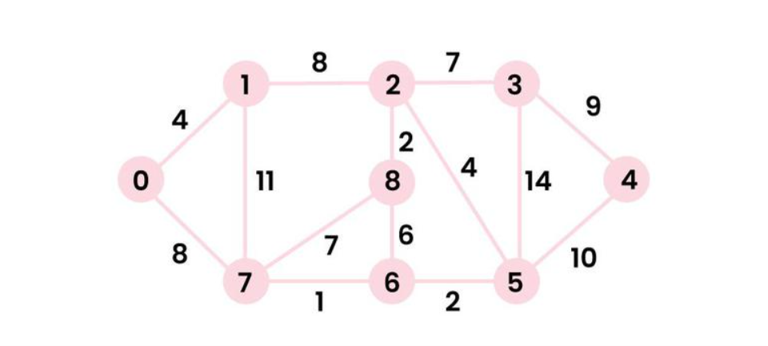

# OUTPUT
## Input Graph

- Compilation command
```bash
gcc dijkstra.c
```
- To run
```bash
./a.out
```
- **Output :**\
Input the details of the graph - \
Enter the number of vertices : 9\
Vertices : 0  &nbsp;1  &nbsp;2  &nbsp;3  &nbsp;4  &nbsp;5  &nbsp;6  &nbsp;7  &nbsp;8  \
Enter the number of edges : 14\
\
Enter 14 edges in the format (vertex1 vertex2 weight): \
0 &ensp;1 &ensp;4\
0 &ensp;7 &ensp;8\
1 &ensp;7 &ensp;11\
1 &ensp;2 &ensp;8\
2 &ensp;8 &ensp;2\
7 &ensp;8 &ensp;7\
7 &ensp;6 &ensp;1\
6 &ensp;8 &ensp;6\
6 &ensp;5 &ensp;2\
5 &ensp;2 &ensp;4\
2 &ensp;3 &ensp;7\
3 &ensp;5 &ensp;14\
3 &ensp;4 &ensp;9\
5 &ensp;4 &ensp;10\
\
Edges:\
0 <-> 1 : &nbsp;4\
0 <-> 7 : &nbsp;8\
1 <-> 7 : &nbsp;11\
1 <-> 2 : &nbsp;8\
2 <-> 8 : &nbsp;2\
7 <-> 8 : &nbsp;7\
7 <-> 6 : &nbsp;1\
6 <-> 8 : &nbsp;6\
6 <-> 5 : &nbsp;2\
5 <-> 2 : &nbsp;4\
2 <-> 3 : &nbsp;7\
3 <-> 5 : &nbsp;14\
3 <-> 4 : &nbsp;9\
5 <-> 4 : &nbsp;10\
Enter the starting vertex between 0 to 8 both inclusive: 0\
Source vertex: 0\
Vertices			&emsp;&emsp;&emsp;Distances from source\
0				&emsp;&emsp;&emsp;&emsp;&emsp;&emsp;&emsp;&emsp;&emsp;&emsp;0\
1				&emsp;&emsp;&emsp;&emsp;&emsp;&emsp;&emsp;&emsp;&emsp;&emsp;4\
2				&emsp;&emsp;&emsp;&emsp;&emsp;&emsp;&emsp;&emsp;&emsp;&ensp; 12\
3				&emsp;&emsp;&emsp;&emsp;&emsp;&emsp;&emsp;&emsp;&emsp;&ensp; 19\
4				&emsp;&emsp;&emsp;&emsp;&emsp;&emsp;&emsp;&emsp;&emsp;&ensp; 21\
5				&emsp;&emsp;&emsp;&emsp;&emsp;&emsp;&emsp;&emsp;&emsp;&ensp; 11\
6				&emsp;&emsp;&emsp;&emsp;&emsp;&emsp;&emsp;&emsp;&emsp;&emsp;9\
7				&emsp;&emsp;&emsp;&emsp;&emsp;&emsp;&emsp;&emsp;&emsp;&emsp;8\
8				&emsp;&emsp;&emsp;&emsp;&emsp;&emsp;&emsp;&emsp;&emsp;&ensp; 14

